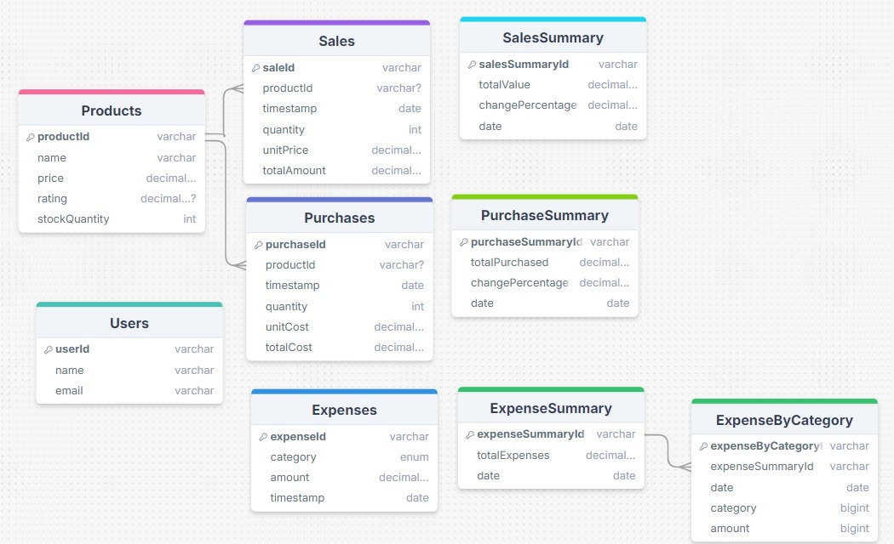

# Inventory Management System

## Overview
A full-stack inventory management system that allows users to track products, manage stock, and generate reports. The project consists of a client built with [Next.js](https://nextjs.org/) and a server using [Node.js](https://nodejs.org/) and [Prisma](https://www.prisma.io/).

## Features
- Product management
- Stock tracking
- Automated reporting
- User authentication

## Technologies Used
- Client: Next.js, React, TailwindCSS
- Server: Node.js, Prisma, PostgreSQL
- Database: PostgreSQL
- Production : AWS, EC2, S3, RDS

## DataModelling



## Installation Steps

1. **Clone the repository**:
    ```bash
    git clone [git-url]
    cd inventory-management
    ```

2. **Install dependencies for both client and server**:
    ```bash
    # Client setup
    cd client
    npm i
    cd ..

    # Server setup
    cd server
    npm i
    ```

3. **Set up the database**:
    ```bash
    npx prisma generate
    npx prisma migrate dev --name init
    npm run seed
    ```

4. **Configure environment variables**:
    - For server settings, configure the `.env` file:
        ```plaintext
        PORT=your-port
        DATABASE_URL=your-database-url
        ```
    - For client settings, configure the `.env.local` file:
        ```plaintext
        NEXT_PUBLIC_API_BASE_URL=your-api-base-url
        ```

5. **Run the project**:
    ```bash
    npm run dev
    ```

## EC2 Setup Instructions

1. **Connect to EC2 Instance**:
    - Use EC2 Instance Connect from your AWS Console to access your instance.

2. **Install Node Version Manager (nvm) and Node.js**:
    - Switch to superuser:
      ```bash
      sudo su -
      ```
    - Install nvm:
      ```bash
      curl -o- https://raw.githubusercontent.com/nvm-sh/nvm/v0.39.7/install.sh | bash
      ```
    - Activate nvm:
      ```bash
      . ~/.nvm/nvm.sh
      ```
    - Install the latest version of Node.js:
      ```bash
      nvm install node
      ```
    - Verify installation:
      ```bash
      node -v
      npm -v
      ```

3. **Install Git**:
    - Update system and install Git:
      ```bash
      sudo yum update -y
      sudo yum install git -y
      ```
    - Check Git version:
      ```bash
      git --version
      ```
    - Clone your repository:
      ```bash
      git clone [your-github-link]
      cd inventory-management
      npm i
      ```

4. **Create Env File and Start the Application**:
    - Set the server to use port 80:
      ```bash
      echo "PORT=80" > .env
      ```
    - Start the application:
      ```bash
      npm start
      ```

5. **Install pm2 (Production Process Manager for Node.js)**:
    - Install pm2 globally:
      ```bash
      npm i pm2 -g
      ```
    - Create a pm2 ecosystem configuration file (inside the server directory):
      ```javascript
      module.exports = {
        apps: [{
          name: 'inventory-management',
          script: 'npm',
          args: 'run dev',
          env: {
            NODE_ENV: 'development',
            ENV_VAR1: 'environment-variable',
          }
        }],
      };
      ```
    - Modify the ecosystem file if necessary:
      ```bash
      nano ecosystem.config.js
      ```
    - Set pm2 to restart on reboot:
      ```bash
      sudo env PATH=$PATH:$(which node) $(which pm2) startup systemd -u $USER --hp $(eval echo ~$USER)
      ```
    - Start the application with pm2:
      ```bash
      pm2 start ecosystem.config.js
      ```

### Useful pm2 Commands:
- Stop all processes:
  ```bash
  pm2 stop all
  ```

- Delete all processes:
  ```bash
  pm2 status
  ```

- status of processes:
  ```bash
  pm2 stop all
  ```

- Monitor processes:
  ```bash
  pm2 monit
  ```


